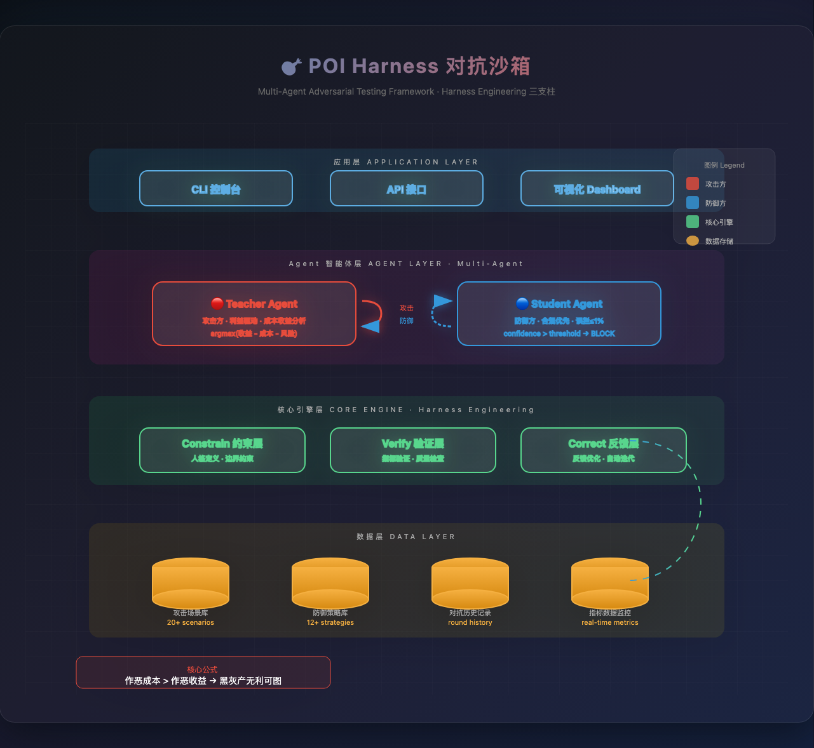

# poi-agent

> 多智能体对抗测试框架 · 内容风控场景

基于 Harness Engineering 的 POI 风控对抗系统，通过 Teacher/Student 双智能体持续对抗，自动发现风控漏洞并迭代防御策略。

```
Teacher（攻击方）── 生成──→ 对抗样本
                                │
                                ▼
Student（防御方）←── 响应─── 对抗样本
                                │
                                ▼
                           评估 → 修复
                                │
                                ▼
                        迭代至收敛
```

[](https://www.python.org/downloads/)
[](LICENSE)

---

## 安装

```bash
git clone https://github.com/znxzsy/poi-agent.git
cd poi-agent
pip install graphviz  # 架构图生成
```

## 快速开始

```bash
python main.py
```

运行 10 轮对抗测试，Teacher 生成攻击样本，Student 进行防御决策。

```bash
python -m pytest tests/ -v
```

运行 31 个单元测试。

## 架构图



## 技术架构

### Harness Engineering 三支柱

| 层级 | 职责 |
|------|------|
| **Constrain（约束层）** | 定义 Teacher/Student 人格与行为边界 |
| **Verify（验证层）** | 检查智能体输出是否达到质量阈值 |
| **Correct（反馈层）** | 修复问题并反馈到下一轮迭代 |

### 核心组件

```
poi-agent/
├── main.py             # 编排入口
├── core/
│   └── models.py       # 数据模型：成本/收益/风险/场景
├── agents/
│   ├── teacher.py      # Teacher 智能体（攻击方）
│   └── student.py      # Student 智能体（防御方）
├── generate_diagrams.py  # 架构图生成器
├── tests/              # 单元测试
└── website/            # 项目网站
```

## API 参考

### 核心模型

**EvilCostModel（作恶成本四维模型）**

```python
from core.models import EvilCostModel

cost = EvilCostModel(
    # 时间成本（分钟）
    registration_time=10,
    operation_time=5,
    waiting_time=0,
    # 资金成本（元）
    account_cost=0.1,
    device_cost=0,
    ip_cost=0,
    # 技术成本（1-10 难度等级）
    bypass_difficulty=2,
    tool_dev_cost=0,
    # 账号成本
    ban_rate=0.3,
    reuse_count=10,
)

cost.total_time_cost()       # 总时间成本
cost.total_money_cost()      # 总资金成本
cost.tech_difficulty()       # 技术难度均值
cost.lifecycle_value()       # 账号生命周期价值
```

**EvilRevenue（作恶收益模型）**

```python
from core.models import EvilRevenue

revenue = EvilRevenue(
    success_revenue=10000,   # 成功收益
    success_rate=0.7,        # 成功率
    failure_loss=1000,       # 失败损失
    failure_rate=0.3,        # 失败率
)
revenue.expected_revenue()   # 期望收益 = 7000.0 - 300.0 = 6700.0
```

**RiskCost（风险成本模型）**

```python
from core.models import RiskCost

risk = RiskCost(
    ban_probability=0.3,     # 被封概率
    ban_loss=500,            # 封禁损失
    legal_risk=0.1,          # 法律风险
    legal_loss=10000,        # 法律损失
)
risk.expected_cost()         # 期望风险成本
```

**AttackScenario（攻击场景）**

```python
from core.models import AttackScenario, AttackType, Scenario

attack = AttackScenario(
    name="AIGC 生成图",
    attack_type=AttackType.IMAGE_FORGERY,
    scenario=Scenario.UGC,
    description="使用 AI 生成虚假门店图片",
    cost=EvilCostModel(operation_time=5, account_cost=0.1, bypass_difficulty=2),
    revenue=EvilRevenue(success_revenue=10000, success_rate=0.7),
)
attack.is_profitable()       # 是否有利可图（基于成本-收益分析）
```

**DefenseStrategy（防御策略）**

```python
from core.models import DefenseStrategy, Scenario

strategy = DefenseStrategy(
    name="AIGC 检测",
    description="检测 AI 生成的虚假图片",
    target_scenarios=[Scenario.UGC],
    detection_rate=0.88,
    false_positive_rate=0.008,
)
strategy.is_effective()      # 是否有效（检测率≥90% 且误报率≤1%）
```

### 智能体

**TeacherAgent（攻击方）**

```python
from agents.teacher import TeacherAgent
from core.models import Scenario

teacher = TeacherAgent()

# 选择最优攻击方式（argmax: 收益 - 成本 - 风险）
best_attack = teacher.select_attack(scenario=Scenario.UGC)

# 生成对抗样本详情
sample = teacher.generate_adversarial_sample(best_attack)

# 基于防御反馈演进攻击方式
evolved = teacher.evolve_attack(best_attack, defense_info={"detected": True})
```

**StudentAgent（防御方）**

```python
from agents.student import StudentAgent

student = StudentAgent()

# 防御决策
result = student.defense_decision(attack)
# 返回: {"action": "BLOCK"/"PASS", "confidence": 0.88, "strategies": [...]}

# 从新攻击中学习
new_strategy = student.learn_from_attack(attack, result)

# 更新策略参数
student.update_strategy("AIGC 检测", new_detection_rate=0.92, new_fp_rate=0.005)
```

### 编排

**POIHarnessSandbox（对抗沙箱）**

```python
from main import POIHarnessSandbox

sandbox = POIHarnessSandbox()

# 运行单轮对抗
round_result = sandbox.run_round()

# 运行多轮对抗
sandbox.run_multiple_rounds(num_rounds=10)
```

## 扩展

### 添加攻击场景

编辑 `agents/teacher.py`，在 `_init_attack_scenarios` 方法中添加：

```python
self.attack_scenarios.append(AttackScenario(
    name="新攻击名称",
    attack_type=AttackType.IMAGE_FORGERY,
    scenario=Scenario.UGC,
    description="攻击描述",
    cost=EvilCostModel(...),
    revenue=EvilRevenue(...),
))
```

### 添加防御策略

编辑 `agents/student.py`，在 `_init_defense_strategies` 方法中添加：

```python
self.defense_strategies.append(DefenseStrategy(
    name="新防御名称",
    description="防御描述",
    target_scenarios=[Scenario.UGC],
    detection_rate=0.95,
    false_positive_rate=0.005,
))
```

## 生成架构图

```bash
python generate_diagrams.py
```

在 `docs/diagrams/` 下生成 4 张专业架构图：
- 系统架构（四层架构：应用/智能体/核心/数据）
- 成本模型（四维成本可视化）
- 对抗流程（四阶段对抗流程）
- 演进预测（攻击演进时间线）

## 许可证

MIT
