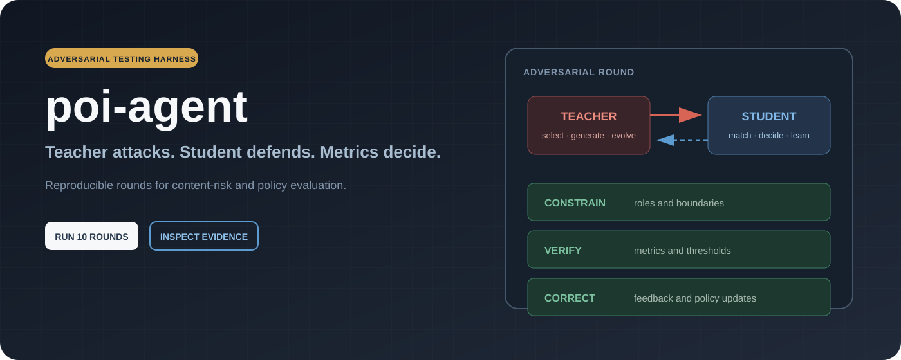
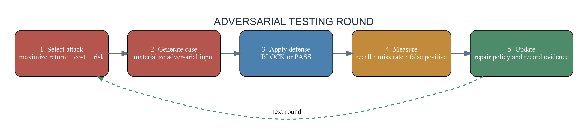
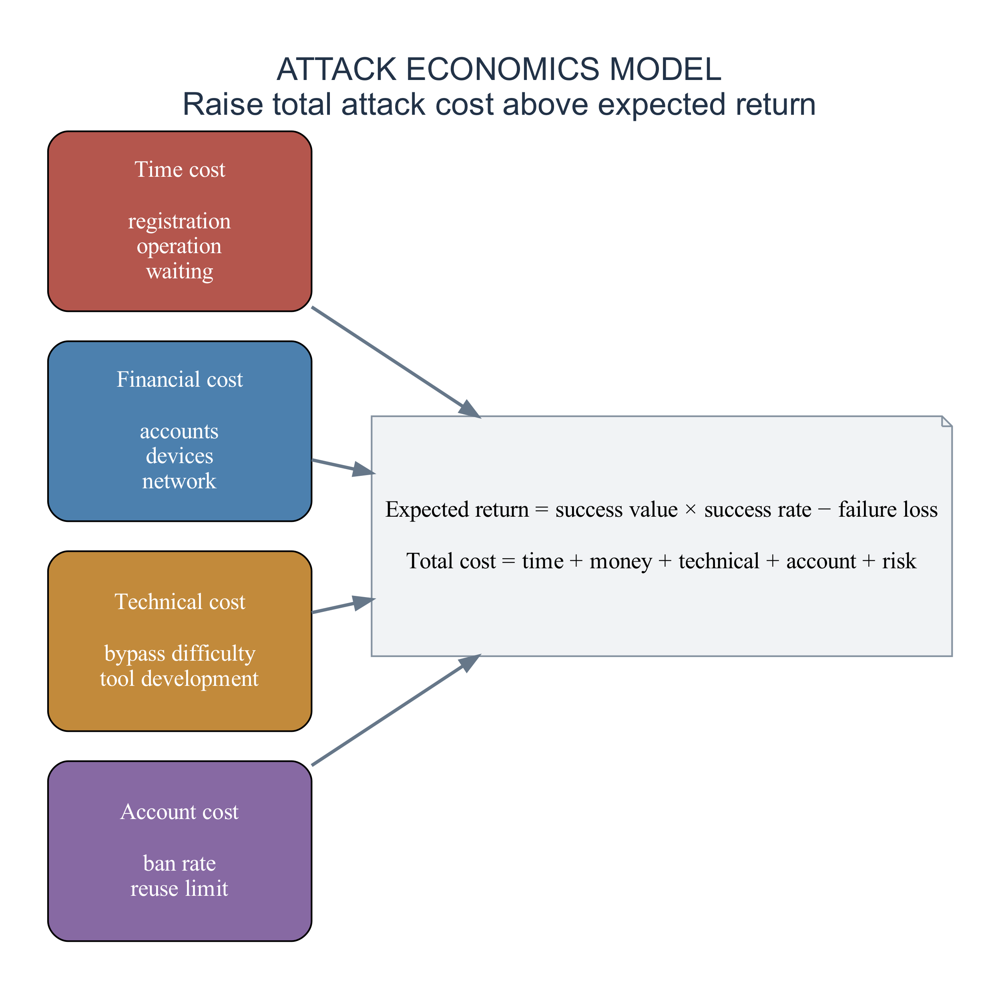

<p align="right"><strong>English</strong> · <a href="README_ZH.md">中文</a></p>

<p align="center">
  
</p>

<p align="center">
  <a href="https://www.python.org/downloads/"></a>
  <a href="LICENSE"></a>
  
</p>

## A test harness for defenses that must survive adaptation

`poi-agent` is a compact research framework for repeated attacker–defender experiments in content-risk systems. A Teacher agent selects and evolves test scenarios; a Student agent applies defense policies; the harness records the outcome, measures misses and false positives, and feeds the evidence into the next round.

It is designed for controlled evaluation and policy iteration—not for operating attacks against live services.

<p align="center">
  
</p>

## What the repository models

| Component | Role |
|---|---|
| **Teacher agent** | Chooses the highest-value test scenario from expected return, execution cost, and risk. |
| **Student agent** | Applies available defenses and returns a structured `BLOCK` or `PASS` decision. |
| **Harness engine** | Constrains agent behavior, verifies round metrics, and records corrective feedback. |
| **Scenario models** | Represent cost, expected revenue, risk, attack type, and operating context. |
| **Round history** | Preserves the evidence needed to compare policies across iterations. |

<p align="center">
  
</p>

## Quick start

```bash
git clone https://github.com/znxzsy/poi-agent.git
cd poi-agent
python main.py
```

Run the test suite:

```bash
python -m pytest tests -q
```

Regenerate the English figures used by the project pages:

```bash
pip install graphviz
python generate_diagrams.py
```

The Graphviz system executable must also be available on your machine.

## Round lifecycle

1. Select a scenario by expected return minus execution cost and risk.
2. Materialize a structured adversarial test case.
3. Ask the Student agent for a defense decision.
4. Measure defense rate, miss rate, and policy quality.
5. Record the failure and update the next test round.

The loop makes model and policy changes comparable. A better defense should improve measured outcomes on the same scenario family—not merely produce a more convincing explanation.

## Core data models

```python
from core.models import (
    AttackScenario,
    AttackType,
    EvilCostModel,
    EvilRevenue,
    RiskCost,
    Scenario,
)

case = AttackScenario(
    name="Synthetic media integrity test",
    attack_type=AttackType.IMAGE_FORGERY,
    scenario=Scenario.UGC,
    description="Controlled test case for a visual integrity policy",
    cost=EvilCostModel(operation_time=5, bypass_difficulty=2),
    revenue=EvilRevenue(success_revenue=100, success_rate=0.4),
    risk=RiskCost(ban_probability=0.5, ban_loss=100),
)

print(case.is_profitable())
```

The cost model separates time, money, technical difficulty, account lifecycle, and risk. This keeps scenario selection explicit and testable instead of burying it in an agent prompt.

<p align="center">
  
</p>

## Repository map

```text
poi-agent/
├── agents/             # Teacher and Student policies
├── core/               # Typed scenario, cost, revenue, and risk models
├── feedback/           # Round-level feedback records
├── scenarios/          # Scenario definitions
├── verification/       # Defense strategies and checks
├── tests/              # Unit tests
├── docs/diagrams/      # English project figures
├── generate_diagrams.py
└── main.py             # Experiment orchestrator
```

## Research scope

This public repository is a simulation harness. Its scenarios are illustrative, its metrics are local, and it does not include production credentials, internal datasets, live endpoints, or operational bypass instructions. Use it to study evaluation design, agent feedback loops, and defense-policy regression under controlled conditions.

## Contact

For research collaboration or a private implementation discussion, contact **znxzsy** on WeChat.

